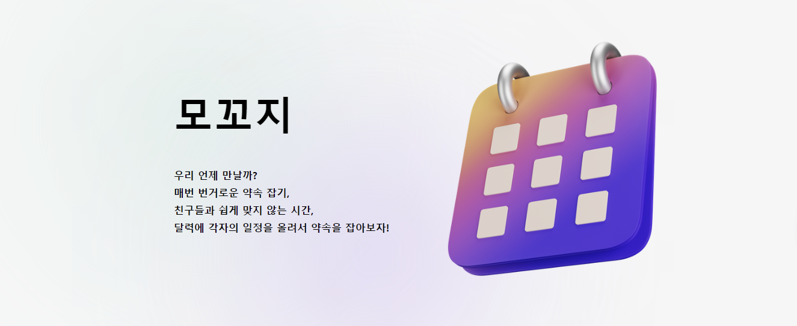
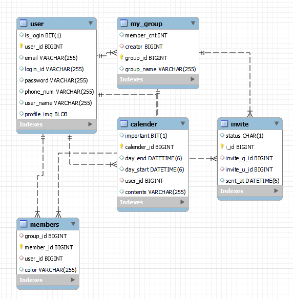

# 📆모꼬지 프로젝트

-> 친구와 약속을 잡을 때, 개인의 일정을 달력에 등록하 **그룹을 통해 약속을 잡을 수 있는** 웹 페이지.
> 23년 6월 25일 ~ 8월 24일 (여름방학 프로젝트)   
 

## 주요 기능 소개
* 드래그를 통해 개인 일정 등록
* 그룹 달력에 친구들을 초대해서 일정 관리
* 그룹 달력에서 그룹원들의 각 일정을 한번에 확인
 

## 팀 구성 및 역할 분담
### 팀명 : 랍스타 

| 황상환 | 조원영 | 박정호 | 진혜린 |
| :------------: | :-------------: | :------------: | :-------------: |
| Content Cell | Content Cell  | Content Cell | Content Cell  |
| FE, BE | FE  | BE | UI  |

 

## 프로젝트 협업 관리

* 팀장을 책임 프로그래머로 선정하여 중앙 집중형 팀 구성
* 학교에서 대면/비대면 회의를 평일 2번, 주말 1번 회의를 통해 협업 관리
* 노선에 계획표를 작성하여 일주일 단위로 계획, 회의마다 회의 내용 기록
* 노션 - https://www.notion.so/a4661d8ffb3e4c60a1951ecc929a1d48?pvs=4

 

## 사용한 기술 스택
      
 
 

## ERD

 
 

## 서비스 핵심 기능

### 로그인 / 회원가입

    

* **가입하기**
  * 사용자의 정보를 입력 후 입력한 이메일로 보내지는 인증코드를 통해 가입
  * 중복되는 아이디와 이메일을 체크하여 중복 가입 방지
  
   
  
* **비밀번호 분실**
  * 비밀번호를 분실했을 경우 가입한 아이디와 이메일을 통해 이메일로 본인인증
  * 본인인증이 완료되면 새로운 비밀번호 설정 가능
 
   

### 내 달력
 

* **일정 추가**
  * 달력에서 날짜를 선택하여 일정을 넣을 수 있습니다.
  * 중요한 일정에는 별 표시를 통해 중요 일정을 체크할 수 있습니다.
  * 오른쪽 미니 달력에서 기간을 선택해서 큰 달력의 화면을 조절 할 수 있습니다.
  * 미니 달력에서 일주일 이하를 선택 시 큰 달력이 시간 달력으로 표시되고, 아니면 월 달력으로 표시됩니다.
 
 

### 그룹 달력
 

 

* **그룹 일정**
  * 왼쪽 바에서 그룹을 선택시 해당 그룹원들의 모든 일정을 **한눈에** 확인할 수 있습니다.
  * 달력에 표시되는 일정이 진할수록 해당 날짜에 여러사람의 일정이 존재합니다.
  * 시간 달력에서 그룹원의 약속 시간이 겹칠 경우, 한 블록에 묶여 일정이 표시됩니다.
  * 월 달력에서 날짜를 클릭하면 해당 날짜에 있는 그룹원들의 일정이 오른쪽에 시간대 별로 표시됩니다.  ( 중요한 일정 시 별이 표시됩니다.)
 

* **그룹 생성 / 수정**
  
          

    * 왼쪽 바에 있는 **+** 버튼을 통해 그룹을 생성할 수 있습니다.
    * 그룹 목록에서 마우스를 올리면 나타나는 설정 버튼을 통해 그룹의 이름을 변경할 수 있고, 그룹 탈퇴를 할 수 있습니다.

 

### 서비스 세부 기능

    

* 그룹 달력에서 각 그룹에 속한 그룹원들의 이름과 프로필 이미지 표시
* 프로필 옆 메세지 버튼을 통해 그룹 초대 수락 / 거절 표시
* 프로필 이미지 클릭 시 9가지의 이미지 선택 가능

   

## 각자 구현한 기능

## 느낌점
